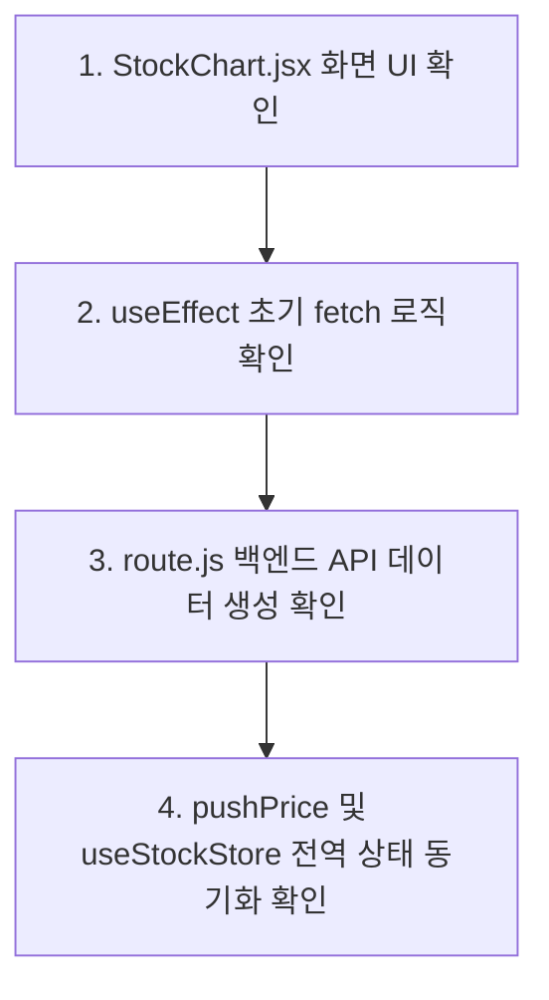

# 🚀 React & Next.js 풀스택 개발 마스터 가이드

본 문서는 `4.react` 과정에서 학습한 01강부터 13강까지의 **모든 React 기초, 성능 최적화, Zustand 전역 상태 관리, Next.js App Router, 서버 컴포넌트, Tailwind v4 다크모드, Recharts 및 WebSocket 실시간 통신**까지의 핵심 이론과 실전 코드 패턴을 체계적으로 종합 정리한 마스터 가이드입니다.

---

## 📌 목차
1. [01강: React 기초 & JSX & Props](#-01강-react-기초--jsx--props)
2. [02강: useState & 이벤트 & 불변성 (Todo App)](#-02강-usestate--이벤트--불변성-todo-app)
3. [03강: 부수효과(useEffect) & DOM 접근(useRef)](#-03강-부수효과useeffect--dom-접근useref)
4. [04강: 커스텀 훅 (Custom Hooks) 설계](#-04강-커스텀-훅-custom-hooks-설계)
5. [05강: 성능 최적화 (memo, useMemo, useCallback, lazy)](#-05강-성능-최적화-memo-usememo-usecallback-lazy)
6. [06강: Context API & 전역 상태 관리](#-06강-context-api--전역-상태-관리)
7. [07강: Next.js App Router & 라우팅 시스템](#-07강-nextjs-app-router--라우팅-시스템)
8. [08강: Zustand 전역 상태 관리 기초](#-08강-zustand-전역-상태-관리-기초)
9. [09강: Next.js API Routes (Route Handlers)](#-09강-nextjs-api-routes-route-handlers)
10. [10강: Zustand 비동기 액션 & Persist (localStorage)](#-10강-zustand-비동기-액션--persist-localstorage)
11. [11강: 서버 컴포넌트 (RSC) vs 클라이언트 컴포넌트](#-11강-서버-컴포넌트-rsc-vs-클라이언트-컴포넌트)
12. [12강: Tailwind CSS v4 다크모드 & ThemeWrapper DOM 조작](#-12강-tailwind-css-v4-다크모드--themewrapper-dom-조작)
13. [13강: Recharts 라인 차트 & WebSocket 실시간 통신](#-13강-recharts-라인-차트--websocket-실시간-통신)
14. [🎯 풀스택 개발 아키텍처 & 코드 탐색 흐름 (Roadmap)](#-풀스택-개발-아키텍처--코드-탐색-흐름-roadmap)

---

## 🔹 01강: React 기초 & JSX & Props

### 1.1 JSX (JavaScript XML) 필수 규칙
* **단일 루트 태그**: 모든 컴포넌트는 하나의 부모 태그(또는 `<>...</>` Fragment)로 감싸져야 합니다.
* **표현식 삽입**: `{}` 자바스크립트 중괄호 안에는 변수, 연산식, 삼항 연산자, 함수 호출만 들어갈 수 있습니다.
* **속성명 변경**: `class` ➡️ `className`, `for` ➡️ `htmlFor`, 이벤트 ➡️ `onClick`, `onChange` (카멜 표기법).

### 1.2 Props (단방향 데이터 전달)
* **부모 ➡️ 자식 방향**: 데이터는 항상 부모에서 자식 컴포넌트로 내려갑니다 (단방향 데이터 흐름).
* **구조 분해 할당 파라미터**:
```jsx
// 자식 컴포넌트에서 Props 받기
export default function UserCard({ name, age, isVip }) {
  return (
    <div className={`card ${isVip ? 'bg-gold' : 'bg-gray'}`}>
      <h3>{name} ({age}세)</h3>
    </div>
  )
}
```

---

## 🔹 02강: useState & 이벤트 & 불변성 (Todo App)

### 2.1 State (상태 관리)
* 컴포넌트 내부에서 변경될 수 있는 유동적인 데이터입니다.
* `const [state, setState] = useState(초기값)` 형태를 사용합니다.

### 2.2 리액트의 핵심: 불변성 (Immutability) 유지
리액트는 **메모리 주소(참조) 변경**을 통해 상태 변화를 감지하므로 기존 객체/배열을 직접 수정(`push`, `splice`, `obj.a = 1`)하면 안 됩니다.
* **배열 추가**: `setItems([...items, newItem])`
* **배열 삭제**: `setItems(items.filter(item => item.id !== targetId))`
* **배열 수정**: `setItems(items.map(item => item.id === targetId ? { ...item, done: !item.done } : item))`

---

## 🔹 03강: 부수효과(useEffect) & DOM 접근(useRef)

### 3.1 useEffect (Side-Effects & 라이프사이클)
* 컴포넌트가 렌더링된 후 외부 시스템(API fetch, 타이머, DOM 조작)과 동기화할 때 사용합니다.
```jsx
useEffect(() => {
  // 실행할 부수 효과 코드
  return () => {
    // 언마운트 또는 의존성 변경 직전 실행할 클린업(Clean-up) 코드
  }
}, [의존성배열])
```
* `[]` (빈 배열): 마운트 시 1회만 실행
* `[state]`: `state`가 변경될 때마다 실행

### 3.2 useRef (변수 보존 & DOM 직접 선택)
1. **리렌더링 없는 변수 저장소**: `.current` 값을 변경해도 컴포넌트가 리렌더링되지 않음.
2. **DOM 요소 직접 접근**: `<input ref={inputRef} />` ➡️ `inputRef.current.focus()`

---

## 🔹 04강: 커스텀 훅 (Custom Hooks) 설계

### 4.1 개념 및 작성 규칙
* 반복되는 로직(예: `useInput`, `useFetch`, `useWindowSize`)을 `use`로 시작하는 독립 함수로 분리하여 재사용합니다.
```jsx
// hooks/useInput.js
import { useState } from 'react'

export function useInput(initialValue = '') {
  const [value, setValue] = useState(initialValue)
  const onChange = (e) => setValue(e.target.value)
  const reset = () => setValue(initialValue)
  return { value, onChange, reset }
}
```

---

## 🔹 05강: 성능 최적화 (memo, useMemo, useCallback, lazy)

### 5.1 최적화 4총사 비교
| 도구 | 대상 | 목적 |
| :--- | :--- | :--- |
| **`React.memo`** | 컴포넌트 | Props가 변경되지 않았다면 자식 컴포넌트 리렌더링 건너뛰기 |
| **`useMemo`** | 연산 결과값 | 복잡한 계산 결과값을 재계산 없이 재사용 |
| **`useCallback`** | 함수 객체 | 컴포넌트 리렌더링 시 함수 객체가 새로 생성되는 것 방지 |
| **`React.lazy + Suspense`** | 모듈/코드 | 초기 로딩 속도 향상을 위한 코드 분할 (Code Splitting) |

```jsx
// useMemo 예시
const expensiveResult = useMemo(() => {
  return computeHugeData(list)
}, [list])

// useCallback 예시
const handleClick = useCallback(() => {
  console.log('클릭됨', id)
}, [id])
```

---

## 🔹 06강: Context API & 전역 상태 관리

### 6.1 Prop Drilling 문제와 Context API
* 여러 단계의 자식 컴포넌트를 거쳐 Props를 전달해야 하는 번거로움을 해결합니다.
```jsx
// 1. Context 생성
const ThemeContext = createContext()

// 2. Provider로 범위 감싸기
export function ThemeProvider({ children }) {
  const [theme, setTheme] = useState('dark')
  return (
    <ThemeContext.Provider value={{ theme, setTheme }}>
      {children}
    </ThemeContext.Provider>
  )
}

// 3. 자식에서 구독
const { theme, setTheme } = useContext(ThemeContext)
```

---

## 🔹 07강: Next.js App Router & 라우팅 시스템

### 7.1 Next.js App Router 폴더 기반 구조
* `src/app/layout.js`: 앱 전역 공통 레이아웃 (HTML 뼈대)
* `src/app/page.js`: 메인 랜딩 페이지 (`/` 경로)
* `src/app/about/page.js`: `/about` 경로 페이지
* `src/app/stock/[symbol]/page.js`: 동적 라우팅 경로 (`/stock/AAPL`, `/stock/TSLA`)

### 7.2 동적 파라미터 수신 (`params`)
```jsx
// src/app/stock/[symbol]/page.js
export default async function StockPage({ params }) {
  const { symbol } = await params // 'AAPL'
  return <div>종목 상세: {symbol}</div>
}
```

---

## 🔹 08강: Zustand 전역 상태 관리 기초

### 8.1 Zustand의 장점
* Context API보다 작고 빠름, 불필요한 리렌더링 방지, Provider 감싸기 불필요.
```javascript
import { create } from 'zustand'

const useStockStore = create((set, get) => ({
  selectedSymbol: 'AAPL',
  selectSymbol: (symbol) => set({ selectedSymbol: symbol }),
}))

export default useStockStore
```

---

## 🔹 09강: Next.js API Routes (Route Handlers)

### 9.1 백엔드 API 엔드포인트 (`route.js`)
* `src/app/api/stock/[symbol]/route.js` 파일에 GET, POST, PUT, DELETE 함수를 export합니다.
```javascript
export async function GET(request, { params }) {
  const { symbol } = await params
  const apiKey = process.env.FINNHUB_API_KEY

  const res = await fetch(`https://finnhub.io/api/v1/quote?symbol=${symbol}&token=${apiKey}`)
  const data = await res.json()

  return Response.json({ symbol, price: data.c })
}
```

---

## 🔹 10강: Zustand 비동기 액션 & Persist (localStorage)

### 10.1 비동기 API 호출 및 Persist 연동
```javascript
import { create } from 'zustand'
import { persist } from 'zustand/middleware'

const useStockStore = create(
  persist(
    (set, get) => ({
      watchlist: ['AAPL', 'TSLA'],
      prices: {},
      
      // 비동기 액션
      fetchPrice: async (symbol) => {
        const res = await fetch(`/api/stock/${symbol}`)
        const data = await res.json()
        set((state) => ({ prices: { ...state.prices, [symbol]: data.price } }))
      },
    }),
    {
      name: 'stock-dashboard', // localStorage 키 이름
      partialize: (state) => ({ watchlist: state.watchlist, theme: state.theme }), // 저장할 상태만 지정
    }
  )
)
```

---

## 🔹 11강: 서버 컴포넌트 (RSC) vs 클라이언트 컴포넌트

### 11.1 지시어 구별 기준
* **서버 컴포넌트 (Server Component)**: 기본값. `'use client'` 없음. 서버에서 HTML 사전 빌드 ➡️ 빠른 로딩, SEO 극대화, DB/환경변수 직접 접근.
* **클라이언트 컴포넌트 (Client Component)**: 맨 위에 `'use client'` 선언. 브라우저에서 실행 ➡️ `useState`, `useEffect`, `onClick`, `WebSocket`, `document` 사용 가능.

---

## 🔹 12강: Tailwind CSS v4 다크모드 & ThemeWrapper DOM 조작

### 12.1 Tailwind v4 `@variant` 다크모드 설정
```css
/* globals.css */
@import "tailwindcss";
@variant dark (&:where(.dark, .dark *));
```

### 12.2 `ThemeWrapper` 최상단 `<html>` 태그 조작
```jsx
'use client'
import { useEffect } from 'react'
import useStockStore from '@/app/store/useStockStore'

export default function ThemeWrapper({ children }) {
  const theme = useStockStore((s) => s.theme)

  useEffect(() => {
    const root = document.documentElement // <html> 전역 요소
    if (theme === 'dark') root.classList.add('dark')
    else root.classList.remove('dark')
  }, [theme])

  return children
}
```

### 12.3 자주 헷갈리는 포인트
* **`ThemeWrapper`로 감싼 영역만 다크모드가 적용되는 게 아니다** — 언뜻 보면 `<ThemeWrapper>{children}</ThemeWrapper>`처럼 JSX로 감싼 범위 안쪽만 영향을 받을 것 같지만, 이 컴포넌트 내부는 `document.documentElement`(`<html>` 태그) 자체를 직접 조작한다. `<body>`도 결국 `<html>`의 자식이므로, JSX 트리에서 감싼 위치와 무관하게 **페이지 전체가 한 번에** 다크모드로 전환된다.
* **`dark:` 클래스는 "조건부 예약어"** — `layout.js`에 `dark:bg-stock-bg`처럼 이미 적혀 있어도 평소(라이트 모드)엔 적용되지 않는다. `<html>`에 `class="dark"`가 붙어 있을 때만 `@variant dark (&:where(.dark, .dark *));` 규칙이 활성화되어 `dark:` 접두사가 붙은 클래스가 일반 클래스를 덮어쓴다.
* **VS Code에서 `@variant`에 빨간 밑줄이 뜬다면** — Tailwind v4의 신규 문법을 에디터 기본 CSS Linter가 아직 인식하지 못해서 나오는 표시일 뿐, 실제 `next build`/`next dev`엔 아무 영향이 없다. 거슬린다면 `.vscode/settings.json`에 `"css.lint.unknownAtRules": "ignore"`를 추가하면 경고가 사라진다.

---

## 🔹 13강: Recharts 라인 차트 & WebSocket 실시간 통신

### 13.0 웹소켓(WebSocket)이란?
* **일반 HTTP 통신(fetch)**: 손님이 주문(Request)할 때만 사장님이 대답(Response)하고 바로 연결이 끊기는 **일회성 주문 방식**.
* **WebSocket 통신(`wss://`)**: 손님과 사장님이 **1:1 전용 전화선을 계속 켜놓고**(양방향 지속 연결) 있다가, 서버에 새 데이터가 생기는 즉시 브라우저로 바로 쏴주는 실시간 통신 방식. 그래서 "구독(subscribe)"과 "연결 종료(close)"라는, 매번 새로 요청을 보내는 fetch에는 없는 개념이 등장한다.

### 13.1 비동기 취소표 (`alive`) 패턴
```javascript
useEffect(() => {
  let alive = true
  setIsLoading(true)

  fetch(`/api/stock/${selectedSymbol}/chart`)
    .then((r) => r.json())
    .then(({ data }) => {
      if (!alive) return // 이전 요청의 응답이면 화면 덮어쓰기 무시
      setChartData(data)
      if (data.length) lastPriceRef.current = data[data.length - 1].price
      setIsLoading(false)
    })

  return () => { alive = false } // 종목 변경 시 취소표 찍기
}, [selectedSymbol])
```
> 💡 **왜 `alive` 같은 취소표가 필요한가**: 종목을 'AAPL'→'TSLA'로 빠르게 바꾸면 두 번의 fetch가 동시에 날아간다. 이때 먼저 보낸 'AAPL' 요청의 응답이 나중에 도착하면, 화면엔 이미 'TSLA'를 보고 있는데 'AAPL' 데이터로 덮어써버리는 경쟁 상태(race condition)가 생긴다. `alive` 변수를 클로저로 캡처해두고 `useEffect`의 클린업에서 `false`로 뒤집으면, "이 effect가 이미 낡은 요청인지"를 응답이 도착한 시점에 판별해 무시할 수 있다.

### 13.2 슬라이딩 윈도우 데이터 유지 (`prev.slice(-59)`)
```javascript
const pushPrice = (price) => {
  const newPrice = parseFloat(price.toFixed(2))
  lastPriceRef.current = newPrice
  const point = { time: nowLabel(), price: newPrice }

  // 뒤에서 59개만 잘라내고 새 1개를 붙여 차트 크기 60개 유지
  setChartData((prev) => [...prev.slice(-59), point])
  setPrice(selectedSymbol, newPrice)
}
```
> 💡 **`-59`가 어떻게 작동하나**: `prev.slice(-59)`는 배열 끝에서부터 59개만 남기고 가장 오래된 앞쪽 데이터를 잘라낸다. 여기에 새 데이터 포인트 1개를 뒤에 붙이면 항상 "최근 60개"로 개수가 고정된다 — 배열이 계속 자라나 렌더링이 느려지는 것을 막는 표준 패턴이다.
> 💡 **`parseFloat(price.toFixed(2))`가 필요한 이유**: `toFixed(2)`는 소수점 둘째 자리까지 반올림해주지만 결과 타입이 `"182.50"` 같은 **문자열**이다. Recharts 등 숫자 연산이 필요한 곳에 그대로 넘기면 타입 버그가 날 수 있어, `parseFloat()`으로 다시 숫자(`182.5`)로 되돌려야 한다.

### 13.3 WebSocket vs Polling 수명주기
```javascript
useEffect(() => {
  if (isLoading) return
  const token = process.env.NEXT_PUBLIC_FINNHUB_API_KEY

  if (token && isUSMarketOpen()) {
    // 1) WebSocket 실시간 연결 (미국장 개장 시간)
    const ws = new WebSocket(`wss://ws.finnhub.io?token=${token}`)
    ws.onopen = () => ws.send(JSON.stringify({ type: 'subscribe', symbol: selectedSymbol }))
    ws.onmessage = (e) => {
      const msg = JSON.parse(e.data)
      if (msg.type === 'trade' && msg.data?.length) {
        pushPrice(msg.data[msg.data.length - 1].p) // 최신 체결가 .p
      }
    }
    return () => {
      if (ws.readyState === WebSocket.OPEN) {
        ws.send(JSON.stringify({ type: 'unsubscribe', symbol: selectedSymbol }))
      }
      ws.close() // 소켓 닫기
    }
  } else {
    // 2) 2초 폴링 폴백 (장 마감 시간대 / 키 미사용 시)
    const id = setInterval(async () => {
      const res = await fetch(`/api/stock/${selectedSymbol}`)
      const q = await res.json()
      if (typeof q.price === 'number' && q.price !== 0) pushPrice(q.price)
    }, 2000)
    return () => clearInterval(id)
  }
}, [selectedSymbol, isLoading, setPrice])
```

### 13.4 자주 헷갈리는 포인트
* **`msg.data[msg.data.length - 1].p`의 `.p`는 문법이 아니다** — Finnhub이 보내주는 응답 객체(`{ type: 'trade', data: [{ s: 'AAPL', p: 182.5, v: 100 }] }`)의 속성 이름일 뿐이다. `data` 배열의 마지막 원소(가장 최근 체결)를 꺼낸 뒤, 그 객체의 가격(price) 값인 `p` 속성을 읽는 것.
* **왜 `NEXT_PUBLIC_` 접두어가 붙은 키를 따로 쓰는가** — Next.js에서 일반 환경변수(`FINNHUB_API_KEY`)는 서버 측(API Routes, Server Component)에서만 읽을 수 있다. 이 컴포넌트처럼 `'use client'` 브라우저 코드에서 웹소켓(`wss://`)에 직접 연결하려면, 변수명 앞에 `NEXT_PUBLIC_`이 붙어 있어야만 Next.js가 빌드 시점에 그 값을 브라우저 번들에 포함시켜 준다 — 그래서 서버 전용 키(`FINNHUB_API_KEY`)와 클라이언트 노출용 키(`NEXT_PUBLIC_FINNHUB_API_KEY`)를 `.env.local`에 각각 따로 등록해야 한다.
* **처음 켰을 때 차트가 옆으로 안 밀린다면** — Finnhub 웹소켓은 **미국 주식 시장 개장 시간(한국 기준 밤 11:30~아침 06:00경)**에만 실시간 체결 데이터를 보낸다. 한국 낮 시간대엔 소켓 연결 자체는 정상이어도 체결 소식이 오지 않아 차트가 멈춰 보이는 게 정상 동작 — 그래서 장 마감 시간대이거나 키가 없을 땐 2초 폴링(`setInterval`)으로 자동 대체하도록 구현했다.
* **`return () => { ws.send(unsubscribe); ws.close() }`가 하는 일** — 종목을 바꾸거나 컴포넌트가 사라질 때 이전 종목의 실시간 구독을 먼저 취소(`unsubscribe`)한 뒤 소켓 연결 자체를 닫는(`close`) 정리 코드. 이걸 빠뜨리면 종목을 여러 번 바꿀 때마다 옛 소켓이 계속 쌓여 메모리 누수가 나거나, 이미 떠난 종목의 시세가 계속 섞여 들어오는 버그가 생긴다.

---

## 🎯 풀스택 개발 아키텍처 & 코드 탐색 흐름 (Roadmap)

### 1. 개발 진행 순서 (1 ➡️ 4)
1. **백엔드 API (`route.js`)**: 응답할 데이터 규격(`{ symbol, data: [{time, price}] }`) 설계
2. **전역 스토어 (`useStockStore.js`)**: 상태(`selectedSymbol`, `prices`, `theme`) 및 변경 액션 정의
3. **UI 화면 (`StockChart.jsx`)**: `useEffect` 초기 fetch 및 Recharts UI 렌더링
4. **실시간 갱신**: WebSocket/Polling 이벤트 수신 후 `pushPrice`로 차트 및 스토어 동기화

### 2. 코드 학습 및 탐색 순서 (화면 ➡️ 백엔드 역방향)


---
* 문서 생성 시각: 2026년 7월 30일 (12·13강 실전 QnA 반영 갱신: 2026년 7월 30일)
* 저장 파일 경로: `C:\Antigravity26_06\React_Nextjs_Master_Guide.md`
* 참고: 12·13강에서 실제로 헷갈렸던 질문들의 전체 기록은 `User_Learning_QnA_Archive.md` 참고.
